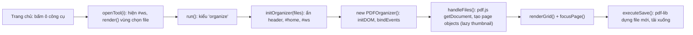

# Kiến trúc PDF Hub (frontend-only)

## Sơ đồ file

| File | Vai trò |
|---|---|
| `index.html` | Trang chủ, danh sách công cụ (mảng `T`), khung làm việc `#ws`, logic các công cụ đơn giản trong `run()` (merge/range/rot dùng pdf-lib; còn lại là **mô phỏng** qua `done()`). |
| `organizer.js` | Class `PDFOrganizer` và hàm `window.initOrganizer(files)`. Tự chèn `organizer.css` và tự nạp pdf.js, Sortable, pdf-lib khi cần (`loadScripts`). |
| `organizer.css` | Style của organizer. Biến màu `--po-*`. Chưa hỗ trợ chế độ tối. |
| `.agents/skills/...` | Skill này. Jekyll bỏ qua thư mục bắt đầu bằng dấu chấm nên không lộ ra trên site. |

## Luồng chạy



Cả "Sắp xếp PDF" và "Chỉnh sửa PDF" đều có kiểu `organize` trong mảng `T`, nên cùng mở organizer.

## Mô hình dữ liệu trang (`this.pages[]`)

```js
{
  id: 'pg_12',          // duy nhất, tăng dần qua this.pageCounter
  type: 'pdf' | 'blank',
  fileIndex: 0,         // chỉ số trong this.files và this.pdfDocs
  pageIndex: 3,         // 0-based trong file nguồn
  rotation: 0,          // độ xoay THÊM vào so với /Rotate gốc, bội số của 90 (có thể âm)
  dataUrl: null | 'data:image/jpeg;base64,...',  // thumbnail, render lười
  selected: false,
  width, height         // hiện là kích thước thumbnail px (giá trị mặc định 595x842 trước khi render)
}
```

Trạng thái khác: `files` (File[]), `pdfDocs` (fileIndex → PDFDocumentProxy của pdf.js), `originalPages` (để thống kê), `history` (mảng JSON string của `pages`), `historyIndex`, `focusedPageId`, `lastSelectedId`, `zoomLevel`, `thumbObserver` (IntersectionObserver), `sortable`.

## Bản đồ method (tìm theo tên, không theo số dòng)

| Nhóm | Method |
|---|---|
| Khởi tạo | `constructor`, `initDOM`, `bindEvents`, `loadScripts` |
| Nạp file | `handleFiles`, `renderThumbnail`, `addBlankPage` |
| Lịch sử | `pushHistory`, `undo`, `redo`, `updateUndoRedo`, `updateStats` |
| Thao tác trang | `actionSelected`, `deleteSelected`, `duplicateSelected`, `updateSelection` |
| Lưới thumbnail | `renderGrid`, `createInsertPoint`, `handleCardClick`, `initSortable` |
| Xem trước | `focusPage`, `navigateKeyboard`, `navigateRelative`, `navigateToPage`, `adjustZoom`, `setZoom` |
| Lưu | `showSaveModal`, `executeSave`, `showSuccess` |
| Tiện ích | `showLoading`, `hideLoading`, `updateProgress` |

## Lỗi đã biết (tính đến lúc tạo skill)

- Nút `po-back` gọi `back()` của index.html, nhưng `back()` **không khôi phục `header`** (vốn bị `initOrganizer` ẩn đi).
- Listener `keydown` gắn vào `document` và không bao giờ gỡ. Mỗi lần mở organizer lại cộng thêm một listener mới.
- `renderGrid()` dựng lại toàn bộ DOM và tạo lại Sortable ở **mỗi** cú click chọn.
- `history` lưu nguyên `dataUrl` base64 ở mỗi bước nên tốn RAM.
- `executeSave` tạo `PDFDocument` mới rồi `copyPages` **từng trang**: chậm và mất bookmark, link nội bộ, metadata.
- Zoom bằng CSS `transform: scale` nên không cuộn được khi phóng to. Xoay trang bằng CSS nên trang ngang bị tràn khung.
- `showSuccess()` thay nội dung `#po-ws` và nút "Tiếp tục" gọi `location.reload()`, làm **mất phiên làm việc**.
- Sortable nạp từ `sortablejs@latest`, chưa cố định phiên bản.

## Bẫy kỹ thuật cần nhớ

1. **pdf.js chuyển quyền sở hữu buffer:** `pdfjsLib.getDocument(buffer)` có thể chuyển (transfer) `ArrayBuffer` sang worker, làm buffer gốc bị "detached". Nếu cần giữ buffer cho pdf-lib, truyền `buffer.slice(0)` cho pdf.js hoặc đọc lại từ `File.arrayBuffer()`.
2. **Font tiếng Việt trong pdf-lib:** font chuẩn (Helvetica…) dùng bảng mã WinAnsi nên sẽ báo lỗi `WinAnsi cannot encode "ạ"`. Bắt buộc dùng `@pdf-lib/fontkit` (`doc.registerFontkit(fontkit)`) và nhúng font TTF có dấu, đặt trong repo (ví dụ `fonts/BeVietnamPro-Regular.ttf`) để tránh CORS. Dùng `{ subset: true }` để file nhẹ.
3. **Hệ tọa độ:** PDF có gốc ở góc **dưới-trái**, đơn vị point (1/72 inch); canvas có gốc ở trên-trái, đơn vị pixel. Dùng `viewport.convertToPdfPoint(x, y)` và `viewport.convertToViewportPoint(x, y)` của pdf.js. Hai hàm này đã xử lý cả `/Rotate` và gốc CropBox khác 0. Đừng tự viết công thức.
4. **Góc xoay:** pdf-lib `page.getRotation().angle` là góc gốc; góc cuối cùng = gốc + `p.rotation`, chuẩn hóa về khoảng 0–359. Khi render có xoay, dùng `page.getViewport({ scale, rotation: (pdfPage.rotate + p.rotation + 360) % 360 })` thay vì xoay bằng CSS.
5. **Giới hạn canvas:** Chrome giới hạn khoảng 16384px mỗi chiều; iOS Safari giới hạn khoảng 16.7 triệu pixel diện tích. Trang khổ A0/A1 ở scale 2 sẽ vượt giới hạn và hiện trắng. Nên giới hạn cạnh dài khoảng 4096px.
6. **Hủy render:** `page.render()` trả về `RenderTask`. Gọi `task.cancel()` khi người dùng đã chuyển trang, rồi bắt lỗi `RenderingCancelledException`.
7. **File mã hóa:** pdf.js mở được file chỉ có owner password, nhưng pdf-lib 1.17 **không giải mã được**. `pdfDoc.getPermissions()` của pdf.js trả về khác `null` khi file có mã hóa hoặc giới hạn quyền.
8. **Giải phóng bộ nhớ:** gọi `pdfDocument.destroy()` cho mỗi doc pdf.js khi đóng organizer; gọi `URL.revokeObjectURL` cho các object URL đã tạo.
9. **Cache GitHub Pages:** mỗi lần deploy phải tăng `?v=N` (script `deploy.ps1` tự làm). Pages mất khoảng 30–90 giây để cập nhật.
10. **PowerShell 5.1:** `Invoke-WebRequest` không có `-UseBasicParsing` có thể treo. Dùng `node -e "fetch(...)"` để kiểm tra site.
